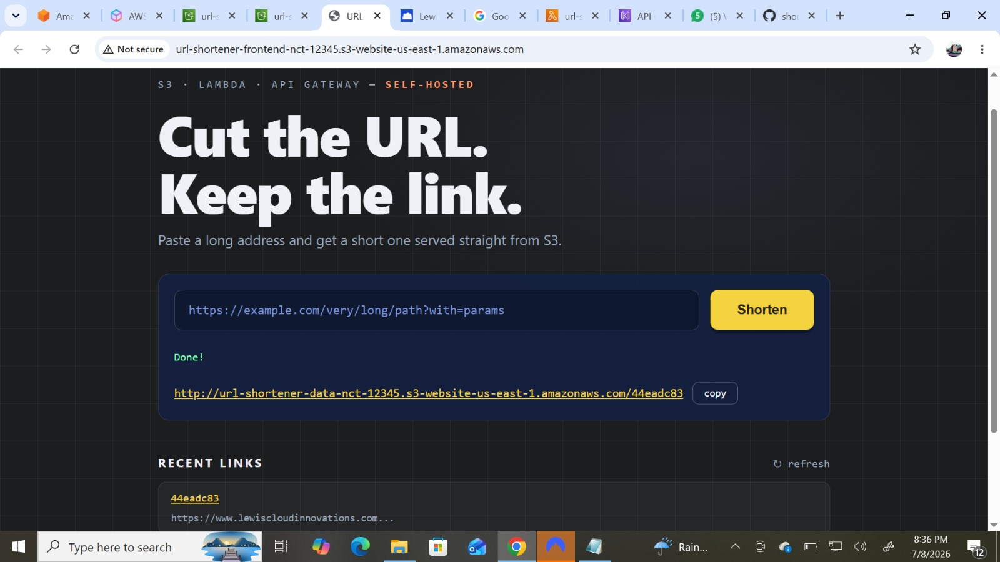
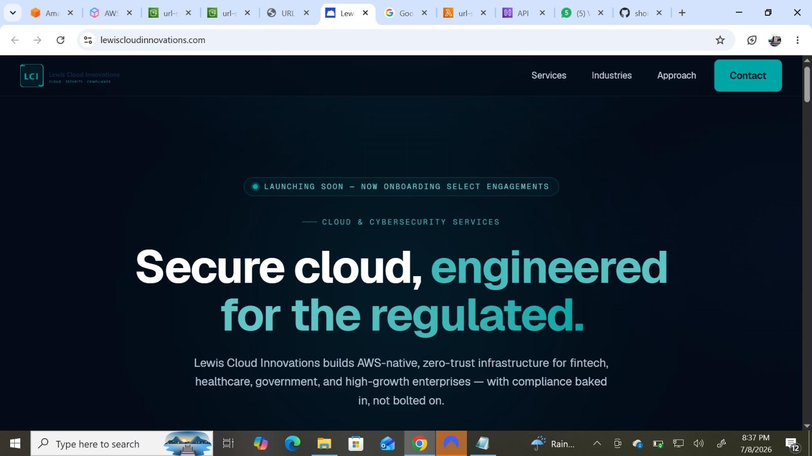

# Cut the URL. Keep the link. ✂️

A URL shortener I built entirely on AWS serverless services — **no database, no servers, nothing to patch or keep running**. The whole "database" is an S3 bucket, and S3 itself performs the redirects. Lambda only runs for a fraction of a second when a new link is created.



## What it does

Paste a long URL into the web page (or hit the API), and you get back a short link like:

```
http://<data-bucket>.s3-website-us-east-1.amazonaws.com/44eadc83
```

Anyone who opens that short link is instantly redirected to the original address.



## The idea behind it

Most URL shorteners follow the same pattern: store `code → long URL` in a database, then run a server that looks up the code on every visit and returns a 301.

This project removes both the database and the server by abusing (in a good way) a little-known S3 feature: **`x-amz-website-redirect-location`**. When a bucket has static website hosting enabled, any object can carry this metadata — and when someone requests that object through the website endpoint, S3 replies with a `301 Moved Permanently` to whatever URL the metadata points at.

So a "short link" here is literally just an **empty, zero-byte object** in S3 whose name is the short code and whose redirect metadata is the destination. S3 stores it, S3 serves it, S3 redirects it. The compute bill for a redirect is zero because no compute happens.

## Architecture

```
 Browser                AWS
 ───────                ───
    │
    │ 1. loads index.html
    ▼
 ┌─────────────────────────┐
 │ S3 frontend bucket      │  static website hosting
 └─────────────────────────┘
    │
    │ 2. POST /shorten  {"url": "https://..."}
    ▼
 ┌─────────────────────────┐
 │ API Gateway (HTTP API)  │  routes + CORS
 └────────────┬────────────┘
              │ 3. invokes
              ▼
 ┌─────────────────────────┐
 │ Lambda (Python)         │  generates short code,
 │                         │  writes empty object with
 │                         │  redirect metadata
 └────────────┬────────────┘
              │ 4. PutObject
              ▼
 ┌─────────────────────────┐
 │ S3 data bucket          │  static website hosting
 │  /44eadc83 → 301        │
 └─────────────────────────┘
    ▲
    │ 5. GET /44eadc83 → 301 → original URL
    │    (S3 does this alone — no Lambda involved)
 short-link visitor
```

**Creating a link:** the frontend sends the long URL to API Gateway, which invokes the Lambda. The Lambda generates a short code, writes the zero-byte redirect object into the data bucket using its IAM execution role, and returns the short URL as JSON.

**Using a link:** the visitor's browser talks to S3's website endpoint directly. S3 sees the redirect metadata on the object and returns a 301. Lambda and API Gateway are not in this path at all.

**The `/stats` route** lists objects in the data bucket so the frontend can show recent links.

## Stack

| Component | Service | Role |
|---|---|---|
| Frontend | S3 static website | Single `index.html` — no framework, no build step |
| API | API Gateway (HTTP API) | `POST /shorten`, `GET /stats`, CORS |
| Backend | Lambda (Python 3.14) | Generates codes, writes redirect objects |
| Storage + redirects | S3 static website | The "database" *and* the redirect engine |

Two pieces of configuration hold it together:

- The **Lambda execution role** has S3 write permissions, which is how link creation works without any credentials in the code.
- Both buckets have a **public-read bucket policy** (with Block Public Access disabled), because the frontend and the redirects are meant to be public. The frontend object's `Content-Type` must be `text/html` so browsers render it instead of downloading it.

## Using the API directly

```bash
curl -X POST \
  https://<api-id>.execute-api.us-east-1.amazonaws.com/shorten \
  -H "Content-Type: application/json" \
  -d '{"url":"https://www.lewiscloudinnovations.com"}'
```

```json
{
  "shortUrl": "http://<data-bucket>.s3-website-us-east-1.amazonaws.com/44eadc83",
  "shortCode": "44eadc83",
  "originalUrl": "https://www.lewiscloudinnovations.com"
}
```

## Deploying your own

1. **Two S3 buckets** (data + frontend), both with static website hosting enabled and public read policies.
2. **Lambda** from [`lambda_function.py`](lambda_function.py), with env vars `BUCKET_NAME` (data bucket) and `BASE_URL` (the data bucket's *website endpoint*), and S3 permissions attached to its execution role.
3. **HTTP API** in API Gateway with `POST /shorten`, `GET /stats`, and `OPTIONS /{proxy+}` all pointed at the Lambda, plus CORS allowing `GET, POST, OPTIONS` and the `Content-Type` header.
4. **Frontend**: set your Invoke URL in `API_ENDPOINT` at the top of [`index.html`](index.html), upload it to the frontend bucket, and open the bucket's website endpoint.

## What I ran into building this

- **The browser downloaded my page instead of showing it** — S3 had served `index.html` with the wrong `Content-Type`. Fixed by making sure the object metadata is `text/html`.
- **`Failed to fetch` from the frontend** — the page needs the real API Gateway Invoke URL set in `API_ENDPOINT`, and API Gateway needs CORS configured, otherwise the browser blocks the request.
- **`Access Denied` on short links** — creating links worked (Lambda writes through its IAM role) but *visiting* them didn't, because public reads are a separate permission. The data bucket needed its own public-read bucket policy.

Order of operations matters less than understanding **who is accessing what**: Lambda writes via IAM, browsers read via bucket policy.

## Costs & limits

For light usage this sits inside the AWS free tier: S3 charges fractions of a cent for storage and requests, Lambda's free tier covers far more invocations than a personal shortener will see, and HTTP APIs are the cheap tier of API Gateway. There is no idle cost — nothing runs between requests.

Trade-offs: short links use the long S3 website hostname (a custom domain via CloudFront + Route 53 fixes that), redirects are HTTP on the raw endpoint (also solved by CloudFront, which adds HTTPS), and click analytics are limited to what S3 access logging provides.

## Tear-down

```bash
aws s3 rb s3://<data-bucket> --force
aws s3 rb s3://<frontend-bucket> --force
aws lambda delete-function --function-name url-shortener-backend
aws apigatewayv2 delete-api --api-id <api-id>
```

## Repo contents

```
.
├── index.html            # Frontend — single file, no dependencies
├── lambda_function.py    # Backend
├── frontend.jpeg         # Screenshot: web UI
├── landingpage.jpeg      # Screenshot: a short link resolving
└── README.md
```

---

Built by [Lewis Cloud Innovations](https://www.lewiscloudinnovations.com)· MIT License
